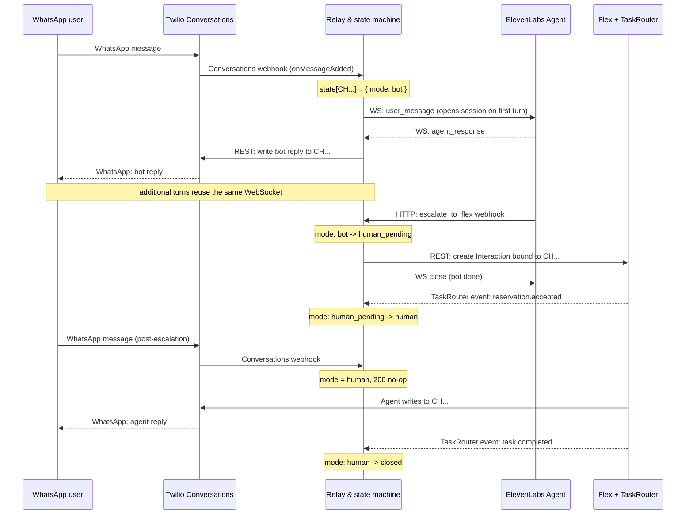

# Twilio WhatsApp to ElevenLabs to Flex Relay Blueprint

For a high-level introduction, see [overview.html](overview.html).

Conversational AI agents on messaging channels need a clean way to escalate to a human without losing the thread.

This repo is a working blueprint for handing an active WhatsApp conversation from an ElevenLabs Conversational AI agent to a human on Twilio Flex, without breaking the customer's thread. The tested channel is WhatsApp. SMS and webchat are on the roadmap and will slot into the same relay, because Twilio Conversations abstracts the underlying channel.

The design commits to Twilio owning the sender and the Conversation from the first message. The Conversation SID (`CH...`) is the shared source of truth across the AI bot turn, the human handoff, and the Flex agent's follow-up. ElevenLabs is used only as the AI runtime for text turns via its Agent WebSocket. When the agent decides a human is needed, it calls a webhook tool that asks the relay to create a Flex Interaction bound to the existing Conversation; Twilio TaskRouter then routes the resulting task to a Flex agent, who joins the same thread rather than receiving a copied transcript.


*Blue: what fires on every customer message (WhatsApp ↔ Twilio ↔ relay webhook). Orange: the bot's runtime, plus the escalation HTTP call from ElevenLabs and the resulting Flex Interaction. Green: the human agent's flow after they accept the Flex task — writing back into the same Conversation, plus the TaskRouter events that move the relay's state machine forward.*

We deliberately do not use ElevenLabs' native WhatsApp integration. Native integration is fine for standalone bots that don't need handoff, but here we want Twilio-controlled routing to Flex with handoff context (`summary`, `intent`, `reason`, customer address, `conversationSid`, `handoffId`).

The blueprint borrows the core handoff idea from the voice-oriented [twilio-elevenlabs-call-handoff-blueprint](https://github.com/rbangueses/twilio-elevenlabs-call-handoff-blueprint). The mechanics here differ because WhatsApp is an asynchronous messaging thread, not a live call.

Paired with the voice blueprint, a single WhatsApp business number can serve both text and voice on the same sender identity. Twilio's [WhatsApp Business Calling](https://github.com/rbangueses/twilio-elevenlabs-call-handoff-blueprint#22-whatsapp-business-calling-entry-point) routes inbound voice calls — the customer taps "call" on your WhatsApp business profile — into the voice blueprint, which hands off to Flex the same way this repo does for messages. [Conversation Memory (§8)](#8-optional-customer-memory) links both interactions to one customer Profile, so an agent joining a voice call today can see the WhatsApp thread from yesterday, and vice versa. It's the shape of a fully Twilio-led AI-plus-human experience across both channels of a single WhatsApp presence.

> **Proof of concept.** This blueprint is a working reference implementation, not a production drop-in. Before using it in production, adapt routing, authentication, prompts, observability, error handling, security controls, data-retention behavior, and compliance posture to your use case.

## Index

- [1. Prerequisites](#1-prerequisites)
- [2. Solution Components](#2-solution-components)
- [3. Architecture](#3-architecture)
- [4. Twilio Setup](#4-twilio-setup)
- [5. ElevenLabs Setup](#5-elevenlabs-setup)
  - [5.1 Register the tool's env vars and secret](#51-register-the-tools-env-vars-and-secret)
  - [5.2 Attach the escalate_to_flex webhook tool](#52-attach-the-escalate_to_flex-webhook-tool)
  - [5.3 Prompt guidance](#53-prompt-guidance)
- [6. Running It Locally](#6-running-it-locally)
- [7. Testing End-to-End](#7-testing-end-to-end)
- [8. Optional: Customer Memory](#8-optional-customer-memory)
- [9. Relay Endpoints](#9-relay-endpoints)
- [10. Payloads](#10-payloads)
  - [10.1 Escalation Payload](#101-escalation-payload)
  - [10.2 Flex Interaction Shape](#102-flex-interaction-shape)
- [11. Reliability Rules](#11-reliability-rules)
- [12. Channel Scope](#12-channel-scope)
- [13. Conversation Modes and State Machine](#13-conversation-modes-and-state-machine)
- [14. What's Next](#14-whats-next)
- [15. Reference Docs](#15-reference-docs)

## 1. Prerequisites

**Twilio-side:**

- A Twilio account.
- A WhatsApp sender (production WhatsApp Business Account or the Twilio WhatsApp sandbox for early testing).
- A Twilio Conversations Service (`IS...`).
- Twilio Flex enabled in the same account, Flex UI 2.x or later.
- The Flex TaskRouter Workspace SID (`WS...`) and Workflow SID (`WW...`) for routed WhatsApp tasks.

**ElevenLabs-side:**

- An ElevenLabs account with Conversational AI access.
- An agent that supports text conversations through the Agent WebSocket.
- An ElevenLabs API key with read/update on agents, tools, secrets, and environment variables.

**Local-dev:**

- Node.js `>=20`.
- ngrok. A static domain (paid tier or claimed subdomain) is strongly recommended — otherwise you'll be updating three Twilio webhook URLs and two ElevenLabs env vars on every restart.

**Shared secret you invent yourself:**

- `HANDOFF_TOKEN` — the bearer token ElevenLabs uses when calling the relay's escalate endpoint. Generate one with `openssl rand -hex 32`.

## 2. Solution Components

Four layered pieces:

- **Twilio Conversations** is the messaging layer. Every customer thread is a Conversation identified by a `CH...` SID. Twilio owns the WhatsApp sender, message delivery, and transcript. Because Conversations is channel-agnostic, the same thread can transition from WhatsApp to SMS or webchat in the future without losing continuity.
- **ElevenLabs Agent WebSocket** is the AI runtime. The relay opens one WebSocket session per active Conversation, sends the customer's message as `user_message`, and receives an `agent_response`. The system prompt, LLM choice, tool definitions, and dynamic variables all live on the ElevenLabs side.
- **The Node relay service (this repo)** is the orchestrator. It receives Twilio Conversations webhooks, bridges to the ElevenLabs WebSocket, writes bot replies back into the Conversation, and creates a Flex Interaction when the agent's `escalate_to_flex` tool fires. It also owns the per-Conversation state machine (`bot → human_pending → human → closed`).
- **Twilio Flex Interactions and TaskRouter** are the human-agent destination. When escalation happens, the relay creates a Flex Interaction bound to the existing `CH...` Conversation, so the Flex agent accepts a Task that carries the same thread the bot was on — no transcript copy, no lost context. TaskRouter distributes the Task to a Flex worker via the Workspace's Workflow.

## 3. Architecture

The static component view is in the diagram above. The sequence below shows the temporal flow of a typical conversation — bot turns, escalation, and human takeover — with the state machine transitions annotated.



Twilio remains the source of truth for:

- The WhatsApp sender.
- The Twilio Conversation SID (`CH...`).
- The customer-facing message history.
- The Flex Interaction and TaskRouter routing state.

ElevenLabs is used as the AI runtime:

- The relay opens an Agent WebSocket conversation.
- Customer WhatsApp messages are sent as `user_message` events.
- ElevenLabs `agent_response` events are written back to Twilio.
- A webhook tool named `escalate_to_flex` asks the relay to route the existing Twilio Conversation to Flex.

## 4. Twilio Setup

Three Twilio-side webhooks must point at the relay before inbound traffic works end-to-end. Set them via the console or the API — the API form (via `curl`) is shown below because it's less error-prone.

**1. Conversations Service post-event webhook.** Fires on every message added across every conversation on the service, filtered to `onMessageAdded`:

```bash
curl -X POST -u "$TWILIO_ACCOUNT_SID:$TWILIO_AUTH_TOKEN" \
  "https://conversations.twilio.com/v1/Services/$TWILIO_CONVERSATIONS_SERVICE_SID/Configuration/Webhooks" \
  --data-urlencode "PostWebhookUrl=https://<your-ngrok>/webhooks/twilio/conversation" \
  --data-urlencode "Filters=onMessageAdded" \
  --data-urlencode "Method=POST"
```

**2. WhatsApp Address Configuration.** New conversations get auto-created when a WhatsApp customer messages your sender. Flex accounts default this to `type: "studio"`, which attaches an auto-response Studio Flow that competes with this relay and pollutes the conversation with empty placeholder messages. Flip it to `type: "webhook"` pointing at our relay:

```bash
# Find the WhatsApp Address Configuration SID (`IG...`) for your sender
curl -u "$TWILIO_ACCOUNT_SID:$TWILIO_AUTH_TOKEN" \
  "https://conversations.twilio.com/v1/Configuration/Addresses" \
  | jq '.address_configurations[] | select(.address == "whatsapp:+<your-sender>")'

# Update it to webhook mode
curl -X POST -u "$TWILIO_ACCOUNT_SID:$TWILIO_AUTH_TOKEN" \
  "https://conversations.twilio.com/v1/Configuration/Addresses/<IG...>" \
  --data-urlencode "AutoCreation.Type=webhook" \
  --data-urlencode "AutoCreation.WebhookUrl=https://<your-ngrok>/webhooks/twilio/conversation" \
  --data-urlencode "AutoCreation.WebhookMethod=POST" \
  --data-urlencode "AutoCreation.WebhookFilters=onMessageAdded"
```

If your account has other channels (SMS, email) with Studio flows attached to their own Address Configurations, leave those untouched — you only need to change the WhatsApp one.

**3. TaskRouter workspace Event Callback.** Advances the state machine on `reservation.accepted`, `task.completed`, and `task.canceled`:

```bash
curl -X POST -u "$TWILIO_ACCOUNT_SID:$TWILIO_AUTH_TOKEN" \
  "https://taskrouter.twilio.com/v1/Workspaces/$FLEX_WORKSPACE_SID" \
  --data-urlencode "EventCallbackUrl=https://<your-ngrok>/webhooks/taskrouter/events" \
  --data-urlencode "EventsFilter=reservation.accepted,task.completed,task.canceled"
```

The message-status endpoint (`/webhooks/twilio/message-status`) is optional and currently expects Twilio Messaging-style status callbacks (`MessageStatus` field). Twilio Conversations' `onDeliveryUpdated` event uses `DeliveryStatus` — the route does not handle that shape today. Leave the message-status webhook unwired unless you're plumbing status callbacks in from the Messaging Service.

## 5. ElevenLabs Setup

Create or choose an ElevenLabs Conversational AI agent for text conversations. If you're reusing a voice agent, either duplicate it for messaging or make sure the messaging session initiation provides values for every dynamic variable referenced by every tool on the agent, otherwise ElevenLabs will terminate the session at start with `Missing required dynamic variables in tools`.

The relay passes these four dynamic variables when opening the WebSocket session:

```json
{
  "twilioConversationSid": "CHxxxxxxxxxxxxxxxxxxxxxxxxxxxxxxxx",
  "customerAddress": "whatsapp:+15551234567",
  "businessAddress": "whatsapp:+14155238886",
  "handoffId": "handoff_CHxxxxxxxx_1700000000000"
}
```

### 5.1 Register the tool's env vars and secret

Webhook tools reference workspace-level env vars (for URL templates like `{{system__env_relay_host}}`) and secrets (for header values, referenced by `env_var_label`). Both must exist **before** you register the tool, or the tool-create call will fail with `Environment variable with label '...' not found`.

Create the secret that carries the bearer token:

```bash
set -o pipefail

# Value must include the "Bearer " prefix — this is used as the raw
# Authorization header value.
curl --fail-with-body -sS -X POST \
  -H "xi-api-key: $ELEVENLABS_API_KEY" \
  -H "Content-Type: application/json" \
  -d "{\"type\":\"new\",\"name\":\"relay_authorization\",\"value\":\"Bearer $HANDOFF_TOKEN\"}" \
  "https://api.elevenlabs.io/v1/convai/secrets" \
  | tee /tmp/relay-authorization-secret.response.json

RELAY_AUTHORIZATION_SECRET_ID="$(jq -r '.secret_id // .id // empty' /tmp/relay-authorization-secret.response.json)"
test -n "$RELAY_AUTHORIZATION_SECRET_ID" || {
  echo "Could not find a secret ID in /tmp/relay-authorization-secret.response.json"
  exit 1
}
```

Then register the env vars referenced by the tool (`relay_host` is a plain string; `relay_authorization` is a secret reference — reuse the `secret_id` returned above):

```bash
# Host only, no https:// prefix. The tool URL already includes https://.
RELAY_HOST="<your-ngrok-host>"

curl --fail-with-body -sS -X POST \
  -H "xi-api-key: $ELEVENLABS_API_KEY" \
  -H "Content-Type: application/json" \
  -d "$(jq -n --arg host "$RELAY_HOST" \
    '{label:"relay_host",type:"string",values:{production:$host}}')" \
  "https://api.elevenlabs.io/v1/convai/environment-variables" \
  | tee /tmp/relay-host-env.response.json

curl --fail-with-body -sS -X POST \
  -H "xi-api-key: $ELEVENLABS_API_KEY" \
  -H "Content-Type: application/json" \
  -d "$(jq -n --arg secret_id "$RELAY_AUTHORIZATION_SECRET_ID" \
    '{label:"relay_authorization",type:"secret",values:{production:{secret_id:$secret_id}}}')" \
  "https://api.elevenlabs.io/v1/convai/environment-variables" \
  | tee /tmp/relay-authorization-env.response.json
```

Verify both environment variable labels exist before creating the tool:

```bash
curl --fail-with-body -sS https://api.elevenlabs.io/v1/convai/environment-variables \
  -H "xi-api-key: $ELEVENLABS_API_KEY" \
  | jq -e '.environment_variables
    | map(select(.label == "relay_host" or .label == "relay_authorization"))
    | sort_by(.label)
    | .[] | {label, type}'
```

### 5.2 Attach the escalate_to_flex webhook tool

See [examples/elevenlabs/escalate-to-flex-tool.example.json](examples/elevenlabs/escalate-to-flex-tool.example.json). The tool references `{{system__env_relay_host}}` in its URL and `env_var_label: "relay_authorization"` in its headers, so the two env vars above must exist first. You can add the tool via the ElevenLabs UI or via `PATCH /v1/convai/agents/{agent_id}`.

To create the WhatsApp escalation tool through the ElevenLabs Tools API, run this from the repo root:

```bash
set -o pipefail

jq '{ tool_config: . }' examples/elevenlabs/escalate-to-flex-tool.example.json \
  > /tmp/escalate-to-flex-tool.request.json

curl --fail-with-body -X POST https://api.elevenlabs.io/v1/convai/tools \
  -H "xi-api-key: $ELEVENLABS_API_KEY" \
  -H "content-type: application/json" \
  --data @/tmp/escalate-to-flex-tool.request.json \
  | tee /tmp/escalate-to-flex-tool.response.json
```

Copy the returned tool ID from `/tmp/escalate-to-flex-tool.response.json`, then attach it to the WhatsApp agent in the ElevenLabs UI or through the agent update API.

### 5.3 Prompt guidance

Use [examples/elevenlabs/agent-prompt-whatsapp.md](examples/elevenlabs/agent-prompt-whatsapp.md) as a copy/paste reference prompt for the WhatsApp messaging agent.

At minimum, the agent prompt should instruct the agent to call `escalate_to_flex` when:

- The customer explicitly asks for a human.
- The customer is frustrated or repeats that the answer is not helping.
- The request requires identity verification, policy judgement, account-specific action, or compliance-sensitive handling outside the bot scope.
- The bot cannot safely complete the task.

If the agent is shared with a voice channel, add channel-routing guidance so the LLM picks the right tool per session:

> Channel routing for escalation: use `escalate_to_flex` when `twilioConversationSid` is set (WhatsApp). Use `escalate_to_human` when `parent_call_sid` is set (voice). Never call both in one session.

## 6. Running It Locally

```bash
npm install
cp .env.example .env
# fill TWILIO_*, FLEX_*, ELEVENLABS_*, HANDOFF_TOKEN. HANDOFF_TOKEN is
# a value you invent; `openssl rand -hex 32` is a good source.
npm run dev
```

The server loads `.env` automatically at startup. You do not need to `source .env` before running `npm run dev`.

Expose port 3000 with ngrok:

```bash
ngrok http 3000
# or with a static domain
ngrok http --domain=<your-static-domain>.ngrok.app 3000
```

Sanity-check the process is up:

```bash
curl http://localhost:3000/health
# {"ok":true,"service":"twilio-elevenlabs-whatsapp-flex-relay","hasTwilio":true,"hasElevenLabs":true,"hasFlex":true}
```

Then wire the ngrok URL into the three Twilio-side webhooks documented in [Twilio Setup](#4-twilio-setup) (Conversations Service post-event, WhatsApp Address Configuration, TaskRouter Event Callback) and confirm the ElevenLabs env vars from [ElevenLabs Setup](#5-elevenlabs-setup) point at the same host.

If you're running behind a TLS-inspection proxy (Zscaler, Netskope, etc.) the WebSocket to `api.elevenlabs.io` will fail with `unable to get local issuer certificate`. Extract the corp CA from your keychain and export `NODE_EXTRA_CA_CERTS`:

```bash
security find-certificate -a -c "<CA-name-substring>" -p /Library/Keychains/System.keychain > /tmp/corp-ca.pem
NODE_EXTRA_CA_CERTS=/tmp/corp-ca.pem npm run dev
```

## 7. Testing End-to-End

With webhooks wired and the relay running, walk through the full loop:

1. Send a message to your WhatsApp sender from your phone — anything conversational works (`hi`).
2. Watch the relay logs — you should see the inbound webhook land, then an outbound bot reply written back to the Conversation. Your phone gets the bot's response on WhatsApp.
3. Send another turn or two to confirm the WebSocket session survives across messages. The state file (`.data/conversation-state.json`) will show one entry with `mode: "bot"`.
4. Ask the bot for a human — something like *"can you connect me to a human"* or *"I need to speak to someone"*.
5. The agent should call `escalate_to_flex`. The relay logs will show the escalate webhook landing, state moving to `human_pending`, and a Flex Interaction being created.
6. In the Flex UI, accept the incoming task. The conversation panel opens with the full history (customer messages + bot replies).
7. When the reservation is accepted, the relay's TaskRouter event handler flips state to `human`. Subsequent customer messages no longer route to ElevenLabs.
8. Send a message from the Flex UI as the human agent. It lands on the customer's WhatsApp thread.
9. Wrap the Flex task. TaskRouter fires `task.completed`, the relay flips state to `closed`, and the ElevenLabs session for that Conversation is torn down.

Live checks along the way:

```bash
# Per-conversation state
cat .data/conversation-state.json | jq .

# Recent HTTP through the ngrok tunnel (open http://localhost:4040 in a browser too)
curl -s "http://localhost:4040/api/requests/http?limit=20" \
  | jq '.requests[] | {t: .start, method: .request.method, path: .request.uri, status: .response.status_code}'

# Recent ElevenLabs conversations for the agent
curl -s -H "xi-api-key: $ELEVENLABS_API_KEY" \
  "https://api.elevenlabs.io/v1/convai/conversations?agent_id=$ELEVENLABS_AGENT_ID&page_size=5" \
  | jq '.conversations[] | {conversation_id, start_time_unix_secs, message_count, status}'
```

Common gotchas:

- **Empty "unsupported content" messages appear in Flex UI.** A Studio Flow auto-attached to the Conversations Service is firing in parallel. See step 2 in [Twilio Setup](#4-twilio-setup) — flip the WhatsApp Address Configuration to `type: "webhook"`.
- **ElevenLabs session terminates immediately with `Missing required dynamic variables in tools`.** The agent has tools referencing dynamic variables you're not sending. Either dedicate a messaging-only agent with just the `escalate_to_flex` tool, or add placeholder values for the missing variables to the session init.
- **`unable to get local issuer certificate` from Node.** Corp TLS-inspection proxy (Zscaler, Netskope). Export `NODE_EXTRA_CA_CERTS` — see the note in [Running It Locally](#6-running-it-locally).
- **Bot replies never arrive but webhooks are landing.** Check the ElevenLabs conversation status via the API. `status: "failed"` with a `terminated_reason` tells you why. Also confirm the agent's `text_only` mode is compatible with your setup.
- **Escalate webhook returns 400.** The relay logs the specific field. Most common is a missing `businessAddress` — the relay falls back to `TWILIO_WHATSAPP_SENDER`, so double-check that env var is set.

## 8. Optional: Customer Memory

Twilio's [Conversation Memory](https://www.twilio.com/docs/conversations/memory) gives the messaging agent access to a Profile-based store so it can recall facts about the customer at the start of a conversation and weave them into replies. Because Conversation Memory resolves identifiers across channels to a single Profile, voice and WhatsApp interactions for the same customer land in one place — no per-channel identifier plumbing on the relay side. The pattern below mirrors the voice blueprint's [§7 Optional Conversation Memory](https://github.com/rbangueses/twilio-elevenlabs-call-handoff-blueprint#7-optional-conversation-memory), pointed at Conversation Memory.

### 8.1 What memory adds

- **Personalization.** *"Hi Alice — I see you called on Monday about your locked account. Did the password reset go through?"*
- **Cross-channel context.** If the customer called yesterday and messages today, the messaging bot can reference the previous voice interaction — Conversation Memory's Identity Resolution links the customer's WhatsApp and phone identifiers to the same Profile.
- **Faster resolution.** The agent doesn't re-ask questions the customer has already answered on another channel.

### 8.2 How identity resolves

Per Twilio's [Identity Resolution docs](https://www.twilio.com/docs/conversations/memory/identity-resolution) (see the Default Identity Rules table), Conversation Memory recognizes four channel identifiers out of the box, each normalized in a specific way:

- **`email`** — Email channel, lowercased.
- **`whatsapp`** — auto-mapped from Twilio WhatsApp traffic.
- **`phone`** — Voice, SMS, RCS, MMS. Normalized to E.164.
- **`chat`** — Chat channel, trimmed.

Custom identifiers such as `user_id` are supported via Custom Identity Rules on the same page. WhatsApp is a **distinct identifier** from phone — two separate keys on the same Profile that Identity Resolution links together, not the same key with a prefix.

Identity Resolution matches identifiers in priority order (`user_id` > `email`/`whatsapp` > `phone` > `chat`). Twilio recommends **uploading customer Profiles up front** rather than relying on automated matching during conversations, so identifiers from every channel resolve to the same Profile from day one.

The relay's role is small: when opening the ElevenLabs session it passes a dynamic variable identifying the customer — typically `customerAddress` (the WhatsApp address it already carries), or a `user_id` read from a Twilio Conversation attribute if you're keying on a custom identifier. The ElevenLabs recall tool forwards that value to Conversation Memory, which handles the Profile lookup.

### 8.3 Attach the recall tool on the messaging agent

The recall side is an ElevenLabs webhook tool that calls Conversation Memory. It follows the same tool + env-var pattern already documented in §5 for `escalate_to_flex`:

1. Set up Conversation Memory per [Twilio's docs](https://www.twilio.com/docs/conversations/memory) and note the recall endpoint URL.
2. Register the memory endpoint as an ElevenLabs environment variable (e.g. `memory_host`) and any auth as a secret-backed env var (e.g. `memory_authorization`).
3. Attach the tool to the messaging agent via the ElevenLabs UI or `PATCH /v1/convai/agents/{agent_id}`. The tool payload sends the identifier the relay passed in its session dynamic variables.

The voice blueprint's [§7 Optional Conversation Memory](https://github.com/rbangueses/twilio-elevenlabs-call-handoff-blueprint#7-optional-conversation-memory) covers the equivalent voice-side tool config — the shape is the same, only the identifier field differs.

### 8.4 Agent prompt guidance

If you use [the reference WhatsApp agent prompt](examples/elevenlabs/agent-prompt-whatsapp.md), the optional memory guidance is already included. If you are using your own prompt, add one line to the agent's system prompt:

> At the start of every conversation, call the memory recall tool with the customer's identifier. If it returns useful context, weave it into your first reply naturally. If it returns nothing, greet the customer without referencing memory.

## 9. Relay Endpoints

| Method | Path | Called by | Purpose |
| --- | --- | --- | --- |
| `GET` | `/health` | Developer, uptime monitor | Verify config and local ngrok tunnel. |
| `POST` | `/webhooks/twilio/conversation` | Twilio Conversations | Receive inbound WhatsApp conversation events. |
| `POST` | `/webhooks/twilio/message-status` | Twilio Messaging Service status callback (optional) | Record delivery status and failures. Expects Twilio Messaging-style `MessageStatus` field; not compatible with Conversations `onDeliveryUpdated` today. |
| `POST` | `/webhooks/elevenlabs/escalate-to-flex` | ElevenLabs webhook tool | Create a Flex Interaction for the existing Twilio Conversation. |
| `POST` | `/webhooks/taskrouter/events` | Twilio TaskRouter | Advance conversation state on reservation.accepted / task.completed / task.canceled. |

## 10. Payloads

### 10.1 Escalation Payload

ElevenLabs calls the relay with:

```json
{
  "conversationSid": "CHxxxxxxxxxxxxxxxxxxxxxxxxxxxxxxxx",
  "elevenlabsConversationId": "conv_abc123",
  "handoffId": "handoff_CHxxxxxxxx_1700000000000",
  "customerAddress": "whatsapp:+15551234567",
  "businessAddress": "whatsapp:+14155238886",
  "intent": "billing_dispute",
  "reason": "explicit_human_request",
  "summary": "Customer is disputing a recent charge and wants a human agent to review the account.",
  "priority": 5
}
```

The relay validates:

- `Authorization: Bearer <HANDOFF_TOKEN>`.
- Required fields present: `conversationSid`, `handoffId`, `customerAddress`, `businessAddress`, `intent`, `reason`, `summary`.
- `conversationSid` starts with `CH`.
- `customerAddress` and `businessAddress` start with `whatsapp:`.
- The conversation exists in local state and is not already escalated.
- `summary`, `intent`, and `reason` are short enough for TaskRouter attributes.
- `elevenlabsConversationId` and `priority` are optional; accepted and stored if present.

### 10.2 Flex Interaction Shape

The relay creates the Flex Interaction using Twilio's Flex Interactions API. Conceptual request body:

```json
{
  "channel": {
    "type": "whatsapp",
    "initiated_by": "customer",
    "properties": {
      "media_channel_sid": "CHxxxxxxxxxxxxxxxxxxxxxxxxxxxxxxxx"
    }
  },
  "routing": {
    "properties": {
      "workspace_sid": "WSxxxxxxxxxxxxxxxxxxxxxxxxxxxxxxxx",
      "workflow_sid": "WWxxxxxxxxxxxxxxxxxxxxxxxxxxxxxxxx",
      "task_channel_unique_name": "chat",
      "attributes": {
        "channelType": "whatsapp",
        "direction": "inbound",
        "name": "whatsapp:+15551234567",
        "from": "whatsapp:+15551234567",
        "customerAddress": "whatsapp:+15551234567",
        "customerName": "whatsapp:+15551234567",
        "businessAddress": "whatsapp:+14155238886",
        "conversationSid": "CHxxxxxxxxxxxxxxxxxxxxxxxxxxxxxxxx",
        "elevenlabsConversationId": "conv_abc123",
        "handoffId": "handoff_CHxxxxxxxx_1700000000000",
        "reason": "explicit_human_request",
        "intent": "billing_dispute",
        "summary": "Customer is disputing a recent charge and wants a human agent to review the account."
      }
    }
  }
}
```

## 11. Reliability Rules

Invariants the relay enforces today. Every bullet here is backed by code and tests — treat them as guardrails not to break in a refactor.

- Validate all Twilio webhooks with `X-Twilio-Signature`.
- Validate ElevenLabs tool calls with a bearer token; fail closed if the token is empty or missing.
- Use an idempotency key for every Twilio event and handoff request (`MessageSid`, `EventSid`, `handoffId`).
- Persist the mode switch to `human_pending` before creating the Flex Interaction, and gate the transition atomically so two racing escalate calls cannot both create Flex Interactions for the same conversation.
- Never send new customer messages to ElevenLabs after `human_pending` or `human`.
- Store enough IDs to debug the full path: `MessageSid`, `ConversationSid`, ElevenLabs `conversation_id`, `handoffId`, Flex `InteractionSid`, and TaskRouter Task SID.

## 12. Channel Scope

The relay is scoped to WhatsApp today. `src/routes/twilio-conversation.js` filters `Author` — messages whose author doesn't start with `whatsapp:` (SMS bare `+E164`, chat identity strings) get a `200` no-op with no state entry or bot session opened. This lets the same Twilio Conversations Service be shared with SMS, chat, or other Flex channels without cross-talk.

**Coming soon:** SMS and webchat support are on the roadmap and will land in this repo. The plan is a per-channel address parser, a `channel` field on state, channel-driven `channelType` on Flex Interaction attributes, and a `channel` dynamic variable passed into the ElevenLabs session so the agent can tune tone and length per medium. See [What's Next](#14-whats-next) for the outline.

## 13. Conversation Modes and State Machine

The relay keeps a small state machine per Twilio Conversation:

| Mode | Meaning | Inbound customer message behavior |
| --- | --- | --- |
| `bot` | ElevenLabs is actively handling the conversation. | Relay to ElevenLabs and write the bot reply back to Twilio. |
| `human_pending` | Escalation has been requested and Flex Interaction creation is in progress. | Do not relay to ElevenLabs. Let messages remain in the Twilio Conversation. |
| `human` | A Flex agent owns the thread. | Do not relay to ElevenLabs. |
| `closed` | The conversation is complete. | Ignore or start a new bot session, depending on product policy. |

The most important rule is simple: once escalation begins, the bot must stop replying in that Twilio Conversation.

Mode transition triggers (details in [docs/architecture.md](docs/architecture.md#mode-transitions)):

- `bot` → `human_pending`: validated `escalate_to_flex` tool call.
- `human_pending` → `human`: TaskRouter `reservation.accepted` for the escalation task.
- `human` → `closed`: TaskRouter `task.completed` or `task.canceled` for the escalation task.

## 14. What's Next

The relay is functionally complete for WhatsApp-only bot-to-Flex routing. Reasonable hardening tracks from here:

- **Move bot handling off the webhook thread.** Today the conversation route does the full inbound flow synchronously — Twilio API calls, ElevenLabs WebSocket handshake if needed, up to 20 seconds waiting for the agent reply, and the outbound bot-message write — all while Twilio's inbound webhook is still open. That can exceed Twilio's ~15s webhook budget on slow turns. Push the ElevenLabs round-trip and bot-reply write into a background worker; return 200 to Twilio immediately after persisting the message on state.
- **Retry outbound API calls with exponential backoff and jitter.** Twilio Conversations writes, ElevenLabs WebSocket sends, and Flex Interactions creation all `await` bare today — a brief upstream blip becomes a hard failure for that customer's message or that handoff. Add retry with jitter (a few attempts spaced ~100 ms → 500 ms → 2 s) around `writeBotMessage`, `sendUserMessage`, and `createInteraction`. The idempotency keys already in place make duplicate retries safe.
- **Multi-channel support (SMS, chat, RCS).** Replace the `whatsapp:` Author filter in `src/routes/twilio-conversation.js` with a per-channel `parseAddress`, record `channel` on state, drive `channelType` on the Flex Interaction attributes from that state field, and pass `channel` into the ElevenLabs session so the agent can adjust tone/length per medium.
- **Production storage adapter.** Swap `src/state/file-store.js` for Redis or Postgres behind the same `Store` interface — the `transitionMode` contract is already there; the file store's global write mutex + per-key locks translate cleanly to WATCH/MULTI (Redis) or `SELECT … FOR UPDATE` (Postgres).
- **Flex UI panel for handoff context.** Surface `summary`, `intent`, `reason`, and `handoffId` prominently for the agent picking up the task — task attributes are already carrying them.
- **Session-manager hardening.** Two known follow-ups: (1) wire `session.onClose(() => sessions.delete(sid))` so a dropped WebSocket gets evicted from the pool; (2) guard the concurrent-open race so two same-conversation webhooks arriving within milliseconds don't both open a session.
- **Message-status endpoint.** Currently expects Twilio Messaging-style `MessageStatus`. To use Conversations' `onDeliveryUpdated`, adapt the route to accept `DeliveryStatus` and expand the Post-Event webhook filter set.

## 15. Reference Docs

- Twilio Flex Conversations: https://www.twilio.com/docs/flex/developer/conversations
- Twilio Flex Interactions API: https://www.twilio.com/docs/flex/developer/conversations/interactions-api/interactions
- Twilio Conversations API: https://www.twilio.com/docs/conversations/api/conversation-resource
- ElevenLabs Agent WebSocket: https://elevenlabs.io/docs/eleven-agents/api-reference/eleven-agents/websocket
- ElevenLabs webhook tools: https://elevenlabs.io/docs/eleven-agents/customization/tools/webhook-tools
- Reference voice blueprint: https://github.com/rbangueses/twilio-elevenlabs-call-handoff-blueprint
