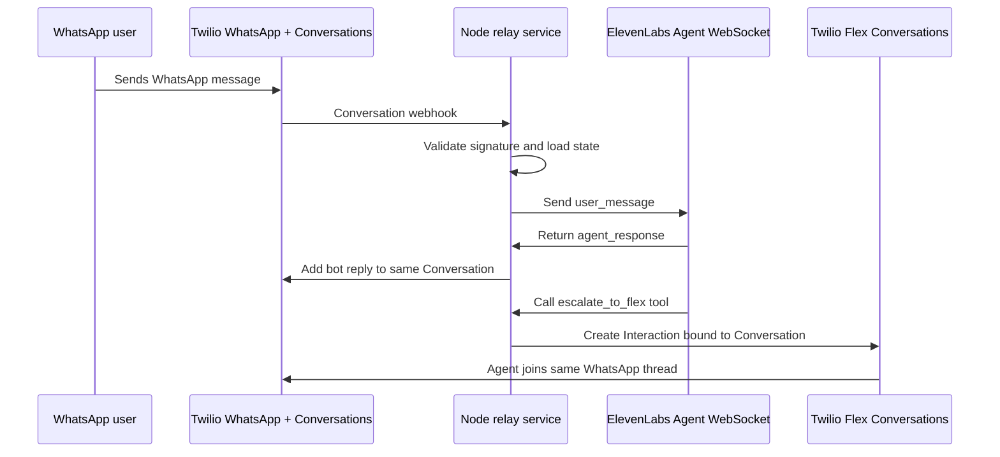

# Twilio WhatsApp to ElevenLabs to Flex Relay Blueprint

This repo is a blueprint for a two-way WhatsApp support relay where Twilio owns the WhatsApp sender and conversation from the first message, ElevenLabs handles the AI agent turn-by-turn, and Twilio Flex receives the same conversation when the customer needs a human.

It borrows the core handoff idea from the voice-oriented [twilio-elevenlabs-call-handoff-blueprint](https://github.com/rbangueses/twilio-elevenlabs-call-handoff-blueprint): keep Twilio in control of the customer channel, pass enough runtime context to ElevenLabs, and let the ElevenLabs agent call a webhook tool when escalation is needed. The mechanics here are different because WhatsApp is an asynchronous messaging thread, not a live call.

## Recommended Architecture

Use a small Node.js relay service as the center of the integration:



Twilio remains the source of truth for:

- The WhatsApp sender.
- The Twilio Conversation SID (`CH...`).
- The customer-facing message history.
- The Flex Interaction and TaskRouter routing state.

ElevenLabs is used as the AI runtime:

- The relay opens an Agent WebSocket conversation.
- Customer WhatsApp messages are sent as `user_message` events.
- ElevenLabs `agent_response` events are written back to Twilio.
- A webhook tool named `escalate_to_flex` asks the relay to route the existing Twilio Conversation to Flex.

## Components

| Component | Responsibility |
| --- | --- |
| `twilio-conversations` | Validate Twilio webhooks, normalize WhatsApp addresses, read/write Conversation messages, and track delivery status. |
| `elevenlabs-session` | Open Agent WebSocket sessions, send initiation data, relay user messages, collect agent responses, and handle ping/pong/tool events. |
| `conversation-state` | Store the mapping between customer address, business sender, Twilio Conversation SID, ElevenLabs conversation ID, mode, and escalation status. |
| `handoff` | Receive ElevenLabs escalation tool calls, validate bearer auth, dedupe handoffs, and create Flex Interactions. |
| `agent-control` | Stop sending customer messages to ElevenLabs after human escalation starts. |
| `observability` | Log correlation IDs across Twilio Message SID, Conversation SID, ElevenLabs conversation ID, Flex Interaction SID, Task SID, and handoff ID. |

## Conversation Modes

The relay should keep a small state machine per Twilio Conversation:

| Mode | Meaning | Inbound customer message behavior |
| --- | --- | --- |
| `bot` | ElevenLabs is actively handling the conversation. | Relay to ElevenLabs and write the bot reply back to Twilio. |
| `human_pending` | Escalation has been requested and Flex Interaction creation is in progress. | Do not relay to ElevenLabs. Let messages remain in the Twilio Conversation. |
| `human` | A Flex agent owns the thread. | Do not relay to ElevenLabs. |
| `closed` | The conversation is complete. | Ignore or start a new bot session, depending on product policy. |

The most important rule is simple: once escalation begins, the bot must stop replying in that Twilio Conversation.

Mode transition triggers (details in [docs/architecture.md](docs/architecture.md#mode-transitions)):

- `bot` → `human_pending`: validated `escalate_to_flex` tool call.
- `human_pending` → `human`: TaskRouter `reservation.accepted` for the escalation task.
- `human` → `closed`: TaskRouter `task.completed` or `task.canceled` for the escalation task.

## Channel Scope

The relay is scoped to WhatsApp today. `src/routes/twilio-conversation.js` filters `Author` — messages whose author doesn't start with `whatsapp:` (SMS bare `+E164`, chat identity strings) get a `200` no-op with no state entry or bot session opened. This lets the same Twilio Conversations Service be shared with SMS, chat, or other Flex channels without cross-talk.

**Coming soon:** SMS and webchat support are on the roadmap and will land in this repo. The plan is a per-channel address parser, a `channel` field on state, channel-driven `channelType` on Flex Interaction attributes, and a `channel` dynamic variable passed into the ElevenLabs session so the agent can tune tone and length per medium. See [What's Next](#whats-next) for the outline.

## Twilio Setup

Account prerequisites:

- A Twilio account.
- A WhatsApp sender configured in Twilio.
- Flex enabled in the same Twilio account.
- Flex UI 2.x or later.
- A Twilio Conversations Service (`IS...`).
- The Flex TaskRouter Workspace SID (`WS...`) and Workflow SID (`WW...`) for routed WhatsApp tasks.

Three Twilio-side webhooks must point at the relay before inbound traffic works end-to-end. Set them via the console or the API — the API form (via `curl`) is shown below because it's less error-prone.

**1. Conversations Service post-event webhook.** Fires on every message added across every conversation on the service, filtered to `onMessageAdded`:

```bash
curl -X POST -u "$TWILIO_ACCOUNT_SID:$TWILIO_AUTH_TOKEN" \
  "https://conversations.twilio.com/v1/Services/$TWILIO_CONVERSATIONS_SERVICE_SID/Configuration/Webhooks" \
  --data-urlencode "PostWebhookUrl=https://<your-ngrok>/webhooks/twilio/conversation" \
  --data-urlencode "Filters=onMessageAdded" \
  --data-urlencode "Method=POST"
```

**2. WhatsApp Address Configuration.** New conversations get auto-created when a WhatsApp customer messages your sender. Flex accounts default this to `type: "studio"`, which attaches an auto-response Studio Flow that competes with this relay and pollutes the conversation with empty placeholder messages. Flip it to `type: "webhook"` pointing at our relay:

```bash
# Find the WhatsApp Address Configuration SID (`IG...`) for your sender
curl -u "$TWILIO_ACCOUNT_SID:$TWILIO_AUTH_TOKEN" \
  "https://conversations.twilio.com/v1/Configuration/Addresses" \
  | jq '.address_configurations[] | select(.address == "whatsapp:+<your-sender>")'

# Update it to webhook mode
curl -X POST -u "$TWILIO_ACCOUNT_SID:$TWILIO_AUTH_TOKEN" \
  "https://conversations.twilio.com/v1/Configuration/Addresses/<IG...>" \
  --data-urlencode "AutoCreation.Type=webhook" \
  --data-urlencode "AutoCreation.WebhookUrl=https://<your-ngrok>/webhooks/twilio/conversation" \
  --data-urlencode "AutoCreation.WebhookMethod=POST" \
  --data-urlencode "AutoCreation.WebhookFilters=onMessageAdded"
```

If your account has other channels (SMS, email) with Studio flows attached to their own Address Configurations, leave those untouched — you only need to change the WhatsApp one.

**3. TaskRouter workspace Event Callback.** Advances the state machine on `reservation.accepted`, `task.completed`, and `task.canceled`:

```bash
curl -X POST -u "$TWILIO_ACCOUNT_SID:$TWILIO_AUTH_TOKEN" \
  "https://taskrouter.twilio.com/v1/Workspaces/$FLEX_WORKSPACE_SID" \
  --data-urlencode "EventCallbackUrl=https://<your-ngrok>/webhooks/taskrouter/events" \
  --data-urlencode "EventsFilter=reservation.accepted,task.completed,task.canceled"
```

The message-status endpoint (`/webhooks/twilio/message-status`) is optional and currently expects Twilio Messaging-style status callbacks (`MessageStatus` field). Twilio Conversations' `onDeliveryUpdated` event uses `DeliveryStatus` — the route does not handle that shape today. Leave the message-status webhook unwired unless you're plumbing status callbacks in from the Messaging Service.

The escalation step creates a Flex Interaction with:

- `channel.type = "whatsapp"`
- `channel.initiated_by = "customer"`
- `channel.properties.media_channel_sid = "CH..."`
- `routing.properties.workspace_sid = "WS..."`
- `routing.properties.workflow_sid = "WW..."`
- `routing.properties.attributes` containing `summary`, `intent`, `reason`, customer address, `businessAddress`, `conversationSid`, ElevenLabs conversation ID, and handoff ID.

Flex then routes the task through TaskRouter and adds the accepting agent to the existing Conversation.

## ElevenLabs Setup

Create or choose an ElevenLabs Conversational AI agent for text conversations. If you're reusing a voice agent, either duplicate it for messaging (recommended — see note below) or make sure the messaging session initiation provides values for every dynamic variable referenced by every tool on the agent, otherwise ElevenLabs will terminate the session at start with `Missing required dynamic variables in tools`.

The relay passes these four dynamic variables when opening the WebSocket session:

```json
{
  "twilioConversationSid": "CHxxxxxxxxxxxxxxxxxxxxxxxxxxxxxxxx",
  "customerAddress": "whatsapp:+15551234567",
  "businessAddress": "whatsapp:+14155238886",
  "handoffId": "handoff_CHxxxxxxxx_1700000000000"
}
```

### 1. Register the tool's env vars and secret

Webhook tools reference workspace-level env vars (for URL templates like `{{system__env_relay_host}}`) and secrets (for header values, referenced by `env_var_label`). Both must exist **before** you register the tool, or the tool-create call will fail with `Environment variable with label '...' not found`.

Create the secret that carries the bearer token:

```bash
# Value must include the "Bearer " prefix — this is used as the raw
# Authorization header value.
curl -X POST -H "xi-api-key: $ELEVENLABS_API_KEY" -H "Content-Type: application/json" \
  -d "{\"type\":\"new\",\"name\":\"relay_authorization\",\"value\":\"Bearer $HANDOFF_TOKEN\"}" \
  "https://api.elevenlabs.io/v1/convai/secrets"
```

Then register the env vars referenced by the tool (`relay_host` is a plain string; `relay_authorization` is a secret reference — reuse the `secret_id` returned above):

```bash
curl -X POST -H "xi-api-key: $ELEVENLABS_API_KEY" -H "Content-Type: application/json" \
  -d '{"label":"relay_host","type":"string","values":{"production":"<your-ngrok-host>"}}' \
  "https://api.elevenlabs.io/v1/convai/environment-variables"

curl -X POST -H "xi-api-key: $ELEVENLABS_API_KEY" -H "Content-Type: application/json" \
  -d '{"label":"relay_authorization","type":"secret","values":{"production":{"secret_id":"<secret_id-from-above>"}}}' \
  "https://api.elevenlabs.io/v1/convai/environment-variables"
```

### 2. Attach the escalate_to_flex webhook tool

See [examples/elevenlabs/escalate-to-flex-tool.example.json](examples/elevenlabs/escalate-to-flex-tool.example.json). The tool references `{{system__env_relay_host}}` in its URL and `env_var_label: "relay_authorization"` in its headers, so the two env vars above must exist first. You can add the tool via the ElevenLabs UI or via `PATCH /v1/convai/agents/{agent_id}`.

### 3. Prompt guidance

The agent prompt should instruct the agent to call `escalate_to_flex` when:

- The customer explicitly asks for a human.
- The customer is frustrated or repeats that the answer is not helping.
- The request requires identity verification, policy judgement, account-specific action, or compliance-sensitive handling outside the bot scope.
- The bot cannot safely complete the task.

If the agent is shared with a voice channel, add channel-routing guidance so the LLM picks the right tool per session:

> Channel routing for escalation: use `escalate_to_flex` when `twilioConversationSid` is set (WhatsApp). Use `escalate_to_human` when `parent_call_sid` is set (voice). Never call both in one session.

## Relay Endpoints

| Method | Path | Called by | Purpose |
| --- | --- | --- | --- |
| `GET` | `/health` | Developer, uptime monitor | Verify config and local ngrok tunnel. |
| `POST` | `/webhooks/twilio/conversation` | Twilio Conversations | Receive inbound WhatsApp conversation events. |
| `POST` | `/webhooks/twilio/message-status` | Twilio Messaging Service status callback (optional) | Record delivery status and failures. Expects Twilio Messaging-style `MessageStatus` field; not compatible with Conversations `onDeliveryUpdated` today. |
| `POST` | `/webhooks/elevenlabs/escalate-to-flex` | ElevenLabs webhook tool | Create a Flex Interaction for the existing Twilio Conversation. |
| `POST` | `/webhooks/taskrouter/events` | Twilio TaskRouter | Advance conversation state on reservation.accepted / task.completed / task.canceled. |

## Escalation Payload

ElevenLabs should call the relay with:

```json
{
  "conversationSid": "CHxxxxxxxxxxxxxxxxxxxxxxxxxxxxxxxx",
  "elevenlabsConversationId": "conv_abc123",
  "handoffId": "handoff_CHxxxxxxxx_1700000000000",
  "customerAddress": "whatsapp:+15551234567",
  "businessAddress": "whatsapp:+14155238886",
  "intent": "billing_dispute",
  "reason": "explicit_human_request",
  "summary": "Customer is disputing a recent charge and wants a human agent to review the account.",
  "priority": 5
}
```

The relay should validate:

- `Authorization: Bearer <HANDOFF_TOKEN>`.
- Required fields present: `conversationSid`, `handoffId`, `customerAddress`, `businessAddress`, `intent`, `reason`, `summary`.
- `conversationSid` starts with `CH`.
- `customerAddress` and `businessAddress` start with `whatsapp:`.
- The conversation exists in local state and is not already escalated.
- `summary`, `intent`, and `reason` are short enough for TaskRouter attributes.
- `elevenlabsConversationId` and `priority` are optional; accept and store them if present.

## Flex Interaction Shape

The relay should create the Flex Interaction using Twilio's Flex Interactions API.

Conceptual request body:

```json
{
  "channel": {
    "type": "whatsapp",
    "initiated_by": "customer",
    "properties": {
      "media_channel_sid": "CHxxxxxxxxxxxxxxxxxxxxxxxxxxxxxxxx"
    }
  },
  "routing": {
    "properties": {
      "workspace_sid": "WSxxxxxxxxxxxxxxxxxxxxxxxxxxxxxxxx",
      "workflow_sid": "WWxxxxxxxxxxxxxxxxxxxxxxxxxxxxxxxx",
      "task_channel_unique_name": "chat",
      "attributes": {
        "channelType": "whatsapp",
        "direction": "inbound",
        "name": "whatsapp:+15551234567",
        "from": "whatsapp:+15551234567",
        "customerAddress": "whatsapp:+15551234567",
        "customerName": "whatsapp:+15551234567",
        "businessAddress": "whatsapp:+14155238886",
        "conversationSid": "CHxxxxxxxxxxxxxxxxxxxxxxxxxxxxxxxx",
        "elevenlabsConversationId": "conv_abc123",
        "handoffId": "handoff_CHxxxxxxxx_1700000000000",
        "reason": "explicit_human_request",
        "intent": "billing_dispute",
        "summary": "Customer is disputing a recent charge and wants a human agent to review the account."
      }
    }
  }
}
```

## Reliability Rules

- Validate all Twilio webhooks with `X-Twilio-Signature`.
- Validate ElevenLabs tool calls with a bearer token.
- Use an idempotency key for every Twilio event and handoff request.
- Return quickly to Twilio webhooks, and move slower work into the relay queue/worker loop.
- Retry Twilio and ElevenLabs API failures with exponential backoff and jitter.
- Persist the mode switch to `human_pending` before creating the Flex Interaction.
- Never send new customer messages to ElevenLabs after `human_pending` or `human`.
- Store enough IDs to debug the full path: `MessageSid`, `ConversationSid`, ElevenLabs `conversation_id`, `handoffId`, Flex `InteractionSid`, and TaskRouter Task SID.

## Reference Docs

- Twilio Flex Conversations: https://www.twilio.com/docs/flex/developer/conversations
- Twilio Flex Interactions API: https://www.twilio.com/docs/flex/developer/conversations/interactions-api/interactions
- Twilio Conversations API: https://www.twilio.com/docs/conversations/api/conversation-resource
- ElevenLabs Agent WebSocket: https://elevenlabs.io/docs/eleven-agents/api-reference/eleven-agents/websocket
- ElevenLabs webhook tools: https://elevenlabs.io/docs/eleven-agents/customization/tools/webhook-tools
- Reference voice blueprint: https://github.com/rbangueses/twilio-elevenlabs-call-handoff-blueprint

## Running It Locally

```bash
npm install
cp .env.example .env
# fill TWILIO_*, FLEX_*, ELEVENLABS_*, HANDOFF_TOKEN. HANDOFF_TOKEN is
# a value you invent; `openssl rand -hex 32` is a good source.
npm run dev
```

Expose port 3000 with ngrok:

```bash
ngrok http 3000
# or with a static domain
ngrok http --domain=<your-static-domain>.ngrok.app 3000
```

Sanity-check the process is up:

```bash
curl http://localhost:3000/health
# {"ok":true,"service":"twilio-elevenlabs-whatsapp-flex-relay","hasTwilio":true,"hasElevenLabs":true,"hasFlex":true}
```

Then wire the ngrok URL into the three Twilio-side webhooks documented in the [Twilio Setup](#twilio-setup) section (Conversations Service post-event, WhatsApp Address Configuration, TaskRouter Event Callback) and confirm the ElevenLabs env vars from the [ElevenLabs Setup](#elevenlabs-setup) section point at the same host.

If you're running behind a TLS-inspection proxy (Zscaler, Netskope, etc.) the WebSocket to `api.elevenlabs.io` will fail with `unable to get local issuer certificate`. Extract the corp CA from your keychain and export `NODE_EXTRA_CA_CERTS`:

```bash
security find-certificate -a -c "<CA-name-substring>" -p /Library/Keychains/System.keychain > /tmp/corp-ca.pem
NODE_EXTRA_CA_CERTS=/tmp/corp-ca.pem npm run dev
```

## What's Next

The relay is functionally complete for WhatsApp-only bot-to-Flex routing. Reasonable hardening tracks from here:

- **Multi-channel support (SMS, chat, RCS).** Replace the `whatsapp:` Author filter in `src/routes/twilio-conversation.js` with a per-channel `parseAddress`, record `channel` on state, drive `channelType` on the Flex Interaction attributes from that state field, and pass `channel` into the ElevenLabs session so the agent can adjust tone/length per medium.
- **Production storage adapter.** Swap `src/state/file-store.js` for Redis or Postgres behind the same `Store` interface — the `transitionMode` contract is already there; the file store's global write mutex + per-key locks translate cleanly to WATCH/MULTI (Redis) or `SELECT … FOR UPDATE` (Postgres).
- **Flex UI panel for handoff context.** Surface `summary`, `intent`, `reason`, and `handoffId` prominently for the agent picking up the task — task attributes are already carrying them.
- **Session-manager hardening.** Two known follow-ups: (1) wire `session.onClose(() => sessions.delete(sid))` so a dropped WebSocket gets evicted from the pool; (2) guard the concurrent-open race so two same-conversation webhooks arriving within milliseconds don't both open a session.
- **Message-status endpoint.** Currently expects Twilio Messaging-style `MessageStatus`. To use Conversations' `onDeliveryUpdated`, adapt the route to accept `DeliveryStatus` and expand the Post-Event webhook filter set.
