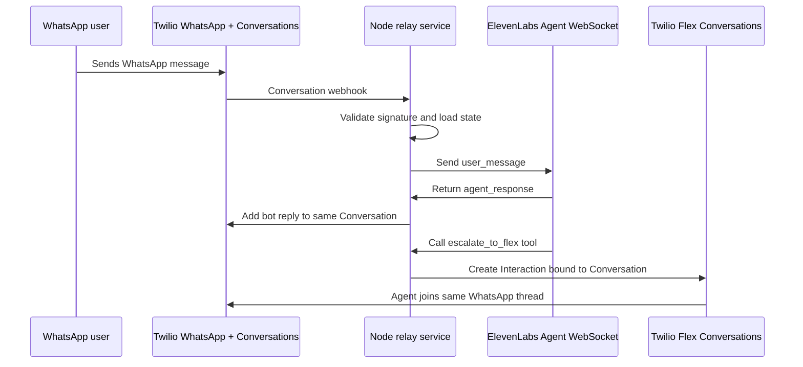

# Twilio WhatsApp to ElevenLabs to Flex Relay Blueprint

This repo is a blueprint for a two-way WhatsApp support relay where Twilio owns the WhatsApp sender and conversation from the first message, ElevenLabs handles the AI agent turn-by-turn, and Twilio Flex receives the same conversation when the customer needs a human.

It borrows the core handoff idea from the voice-oriented [twilio-elevenlabs-call-handoff-blueprint](https://github.com/rbangueses/twilio-elevenlabs-call-handoff-blueprint): keep Twilio in control of the customer channel, pass enough runtime context to ElevenLabs, and let the ElevenLabs agent call a webhook tool when escalation is needed. The mechanics here are different because WhatsApp is an asynchronous messaging thread, not a live call.

## Recommended Architecture

Use a small Node.js relay service as the center of the integration:



Twilio remains the source of truth for:

- The WhatsApp sender.
- The Twilio Conversation SID (`CH...`).
- The customer-facing message history.
- The Flex Interaction and TaskRouter routing state.

ElevenLabs is used as the AI runtime:

- The relay opens an Agent WebSocket conversation.
- Customer WhatsApp messages are sent as `user_message` events.
- ElevenLabs `agent_response` events are written back to Twilio.
- A webhook tool named `escalate_to_flex` asks the relay to route the existing Twilio Conversation to Flex.

## Why A Node Service Instead Of Twilio Functions Only?

Twilio Functions are useful for thin webhooks, health checks, and small helper endpoints, but the relay core needs to manage WebSocket sessions, tool callbacks, idempotency, and conversation state. A long-running Node service is a better fit for that lifecycle.

A Functions-only proof of concept can be built by opening a fresh ElevenLabs WebSocket on every inbound message, sending recent Twilio Conversation history plus the new user turn, waiting for one answer, then exiting. This repo treats that as a constrained demo path, not the recommended architecture.

## Components

| Component | Responsibility |
| --- | --- |
| `twilio-conversations` | Validate Twilio webhooks, normalize WhatsApp addresses, read/write Conversation messages, and track delivery status. |
| `elevenlabs-session` | Open Agent WebSocket sessions, send initiation data, relay user messages, collect agent responses, and handle ping/pong/tool events. |
| `conversation-state` | Store the mapping between customer address, business sender, Twilio Conversation SID, ElevenLabs conversation ID, mode, and escalation status. |
| `handoff` | Receive ElevenLabs escalation tool calls, validate bearer auth, dedupe handoffs, and create Flex Interactions. |
| `agent-control` | Stop sending customer messages to ElevenLabs after human escalation starts. |
| `observability` | Log correlation IDs across Twilio Message SID, Conversation SID, ElevenLabs conversation ID, Flex Interaction SID, Task SID, and handoff ID. |

## Conversation Modes

The relay should keep a small state machine per Twilio Conversation:

| Mode | Meaning | Inbound customer message behavior |
| --- | --- | --- |
| `bot` | ElevenLabs is actively handling the conversation. | Relay to ElevenLabs and write the bot reply back to Twilio. |
| `human_pending` | Escalation has been requested and Flex Interaction creation is in progress. | Do not relay to ElevenLabs. Let messages remain in the Twilio Conversation. |
| `human` | A Flex agent owns the thread. | Do not relay to ElevenLabs. |
| `closed` | The conversation is complete. | Ignore or start a new bot session, depending on product policy. |

The most important rule is simple: once escalation begins, the bot must stop replying in that Twilio Conversation.

Mode transition triggers (details in [docs/architecture.md](docs/architecture.md#mode-transitions)):

- `bot` → `human_pending`: validated `escalate_to_flex` tool call.
- `human_pending` → `human`: TaskRouter `reservation.accepted` for the escalation task.
- `human` → `closed`: Twilio Conversations `onConversationStateUpdated` with `State=closed`, or TaskRouter `task.completed` / `task.canceled`.

## Local Development With ngrok

Run the relay locally:

```bash
npm run dev
```

Expose it to Twilio:

```bash
ngrok http 3000
```

Use the ngrok HTTPS URL in Twilio webhook configuration:

```text
https://your-ngrok-domain.ngrok-free.app/webhooks/twilio/conversation
https://your-ngrok-domain.ngrok-free.app/webhooks/twilio/message-status
https://your-ngrok-domain.ngrok-free.app/webhooks/elevenlabs/escalate-to-flex
```

Before changing Twilio configuration, check:

```bash
curl https://your-ngrok-domain.ngrok-free.app/health
```

Expected response shape:

```json
{
  "ok": true,
  "service": "twilio-elevenlabs-whatsapp-flex-relay",
  "hasTwilio": true,
  "hasElevenLabs": true,
  "hasFlex": true
}
```

## Twilio Setup

You need:

- A Twilio account.
- A WhatsApp sender configured in Twilio.
- Flex enabled in the same Twilio account.
- Flex UI 2.x or later.
- A Twilio Conversations Service.
- A Conversations Address or WhatsApp sender configuration that can invoke your relay webhook.
- The Flex TaskRouter Workspace SID (`WS...`) and Workflow SID (`WW...`) for routed WhatsApp tasks.

The escalation step creates a Flex Interaction with:

- `channel.type = "whatsapp"`
- `channel.initiated_by = "customer"`
- `channel.properties.media_channel_sid = "CH..."`
- `routing.properties.workspace_sid = "WS..."`
- `routing.properties.workflow_sid = "WW..."`
- `routing.properties.attributes` containing summary, intent, customer address, `conversationSid`, ElevenLabs conversation ID, and handoff ID.

Flex then routes the task through TaskRouter and adds the accepting agent to the existing Conversation.

## ElevenLabs Setup

Create or choose an ElevenLabs agent that supports text conversations through the Agent WebSocket.

Pass these dynamic variables when the relay starts the ElevenLabs session:

```json
{
  "twilioConversationSid": "CHxxxxxxxxxxxxxxxxxxxxxxxxxxxxxxxx",
  "customerAddress": "whatsapp:+15551234567",
  "businessAddress": "whatsapp:+14155238886",
  "handoffId": "handoff_CHxxxxxxxx_1700000000000"
}
```

Attach an ElevenLabs webhook tool named `escalate_to_flex`. See [examples/elevenlabs/escalate-to-flex-tool.example.json](examples/elevenlabs/escalate-to-flex-tool.example.json).

The agent prompt should instruct the agent to call `escalate_to_flex` when:

- The customer explicitly asks for a human.
- The customer is frustrated or repeats that the answer is not helping.
- The request requires identity verification, policy judgement, account-specific action, or compliance-sensitive handling outside the bot scope.
- The bot cannot safely complete the task.

## Relay Endpoints

| Method | Path | Called by | Purpose |
| --- | --- | --- | --- |
| `GET` | `/health` | Developer, uptime monitor | Verify config and local ngrok tunnel. |
| `POST` | `/webhooks/twilio/conversation` | Twilio Conversations | Receive inbound WhatsApp conversation events. |
| `POST` | `/webhooks/twilio/message-status` | Twilio Messaging or Conversations | Record delivery status and failures. |
| `POST` | `/webhooks/elevenlabs/escalate-to-flex` | ElevenLabs webhook tool | Create a Flex Interaction for the existing Twilio Conversation. |
| `POST` | `/webhooks/taskrouter/events` | Twilio TaskRouter | Advance conversation state on reservation.accepted / task.completed / task.canceled. |

## Escalation Payload

ElevenLabs should call the relay with:

```json
{
  "conversationSid": "CHxxxxxxxxxxxxxxxxxxxxxxxxxxxxxxxx",
  "elevenlabsConversationId": "conv_abc123",
  "handoffId": "handoff_CHxxxxxxxx_1700000000000",
  "customerAddress": "whatsapp:+15551234567",
  "businessAddress": "whatsapp:+14155238886",
  "intent": "billing_dispute",
  "reason": "explicit_human_request",
  "summary": "Customer is disputing a recent charge and wants a human agent to review the account.",
  "priority": 5
}
```

The relay should validate:

- `Authorization: Bearer <HANDOFF_TOKEN>`.
- Required fields present: `conversationSid`, `handoffId`, `customerAddress`, `businessAddress`, `intent`, `reason`, `summary`.
- `conversationSid` starts with `CH`.
- `customerAddress` and `businessAddress` start with `whatsapp:`.
- The conversation exists in local state and is not already escalated.
- `summary`, `intent`, and `reason` are short enough for TaskRouter attributes.
- `elevenlabsConversationId` and `priority` are optional; accept and store them if present.

## Flex Interaction Shape

The relay should create the Flex Interaction using Twilio's Flex Interactions API.

Conceptual request body:

```json
{
  "channel": {
    "type": "whatsapp",
    "initiated_by": "customer",
    "properties": {
      "media_channel_sid": "CHxxxxxxxxxxxxxxxxxxxxxxxxxxxxxxxx"
    }
  },
  "routing": {
    "properties": {
      "workspace_sid": "WSxxxxxxxxxxxxxxxxxxxxxxxxxxxxxxxx",
      "workflow_sid": "WWxxxxxxxxxxxxxxxxxxxxxxxxxxxxxxxx",
      "task_channel_unique_name": "chat",
      "attributes": {
        "channelType": "whatsapp",
        "direction": "inbound",
        "name": "whatsapp:+15551234567",
        "from": "whatsapp:+15551234567",
        "customerAddress": "whatsapp:+15551234567",
        "customerName": "whatsapp:+15551234567",
        "businessAddress": "whatsapp:+14155238886",
        "conversationSid": "CHxxxxxxxxxxxxxxxxxxxxxxxxxxxxxxxx",
        "elevenlabsConversationId": "conv_abc123",
        "handoffId": "handoff_CHxxxxxxxx_1700000000000",
        "reason": "explicit_human_request",
        "intent": "billing_dispute",
        "summary": "Customer is disputing a recent charge and wants a human agent to review the account."
      }
    }
  }
}
```

## Reliability Rules

- Validate all Twilio webhooks with `X-Twilio-Signature`.
- Validate ElevenLabs tool calls with a bearer token.
- Use an idempotency key for every Twilio event and handoff request.
- Return quickly to Twilio webhooks, and move slower work into the relay queue/worker loop.
- Retry Twilio and ElevenLabs API failures with exponential backoff and jitter.
- Persist the mode switch to `human_pending` before creating the Flex Interaction.
- Never send new customer messages to ElevenLabs after `human_pending` or `human`.
- Store enough IDs to debug the full path: `MessageSid`, `ConversationSid`, ElevenLabs `conversation_id`, `handoffId`, Flex `InteractionSid`, and TaskRouter Task SID.

## Reference Docs

- Twilio Flex Conversations: https://www.twilio.com/docs/flex/developer/conversations
- Twilio Flex Interactions API: https://www.twilio.com/docs/flex/developer/conversations/interactions-api/interactions
- Twilio Conversations API: https://www.twilio.com/docs/conversations/api/conversation-resource
- ElevenLabs Agent WebSocket: https://elevenlabs.io/docs/eleven-agents/api-reference/eleven-agents/websocket
- ElevenLabs webhook tools: https://elevenlabs.io/docs/eleven-agents/customization/tools/webhook-tools
- Reference voice blueprint: https://github.com/rbangueses/twilio-elevenlabs-call-handoff-blueprint

## Running the Relay

Install and start:

```bash
npm install
cp .env.example .env
# fill in TWILIO_*, FLEX_*, ELEVENLABS_*, HANDOFF_TOKEN, BOT_IDENTITY
npm run dev
```

Expose it and configure webhooks:

```bash
ngrok http 3000
```

Set these URLs in Twilio and ElevenLabs:

| Consumer | URL |
| --- | --- |
| Twilio Conversations (`onMessageAdded`, form-encoded) | `https://<ngrok>/webhooks/twilio/conversation` |
| Twilio Conversations status callback | `https://<ngrok>/webhooks/twilio/message-status` |
| Twilio TaskRouter Event Callback | `https://<ngrok>/webhooks/taskrouter/events` |
| ElevenLabs `escalate_to_flex` tool | `https://<ngrok>/webhooks/elevenlabs/escalate-to-flex` |

## Next Steps

1. Implement the Node relay service.
2. Add local state storage for development, then choose Redis/Postgres/DynamoDB for production.
3. Configure ngrok and Twilio Conversations webhooks.
4. Configure the ElevenLabs escalation tool.
5. Test bot-only replies.
6. Test escalation into Flex.
7. Add Flex UI customization to surface `summary`, `intent`, and `handoffId` prominently for agents.
