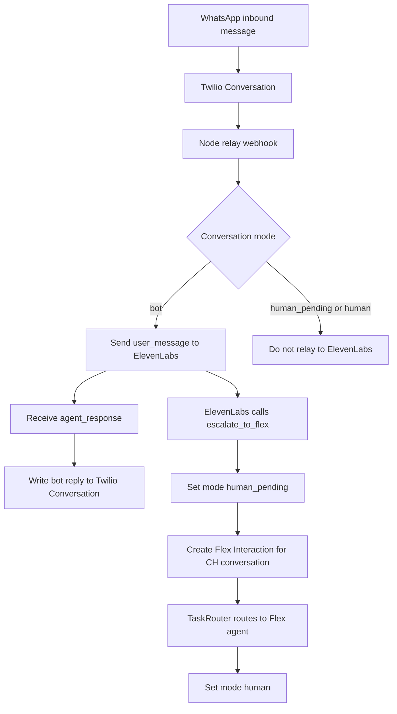

# Architecture

This blueprint uses Twilio Conversations as the canonical messaging layer, a Node.js relay service as the orchestration layer, ElevenLabs as the AI agent runtime, and Twilio Flex as the human-agent destination.

## Design Goals

- Twilio owns the WhatsApp sender and the conversation from the first customer message.
- The complete customer-visible transcript remains in one Twilio Conversation.
- ElevenLabs can handle normal bot turns without owning the WhatsApp account.
- Escalation passes the existing Twilio Conversation to Flex, not a copied transcript.
- Human agents and the bot never respond at the same time.
- Local testing works with ngrok.

## Runtime Flow



## State Model

The relay needs durable state per active Twilio Conversation.

```json
{
  "conversationSid": "CHxxxxxxxxxxxxxxxxxxxxxxxxxxxxxxxx",
  "customerAddress": "whatsapp:+15551234567",
  "businessAddress": "whatsapp:+14155238886",
  "mode": "bot",
  "elevenlabsConversationId": "conv_abc123",
  "elevenlabsSessionStatus": "connected",
  "handoffId": null,
  "flexInteractionSid": null,
  "taskSid": null,
  "lastInboundMessageSid": "IMxxxxxxxxxxxxxxxxxxxxxxxxxxxxxxxx",
  "lastCustomerMessageAt": "2026-08-12T20:30:00.000Z",
  "createdAt": "2026-08-12T20:00:00.000Z",
  "updatedAt": "2026-08-12T20:30:01.000Z"
}
```

For local development, a file-backed store or SQLite is enough. For production, use Redis, Postgres, DynamoDB, or another store with conditional updates so the `bot -> human_pending` transition is atomic.

## Mode Transitions

| Transition | Trigger | Owner |
| --- | --- | --- |
| `bot -> human_pending` | `escalate_to_flex` tool call validated. Mode is persisted before the Flex Interaction is created. | Handoff Controller |
| `human_pending -> human` | TaskRouter `reservation.accepted` event for the escalation task. Fallback: Conversations `onParticipantAdded` when a Flex worker joins. | TaskRouter Event Handler |
| `human -> closed` | Twilio Conversations `onConversationStateUpdated` with `State=closed`, or TaskRouter `task.completed` / `task.canceled`. | TaskRouter Event Handler |
| `closed -> bot` (optional) | Admin reset for a new session. Opt-in only. | Agent Control |

`handoffId` is minted by the relay when it opens the ElevenLabs session for a Conversation, using the format `handoff_<conversationSid>_<epoch_ms>`. It is not a Twilio or ElevenLabs identifier.

## Idempotency

Twilio webhooks can retry. ElevenLabs tool calls can also be retried or repeated by the agent. The relay should make every operation idempotent.

Recommended keys:

| Operation | Idempotency key |
| --- | --- |
| Inbound Twilio event | Twilio event ID if present, otherwise `MessageSid` plus event type. |
| Bot reply write | `conversationSid` plus ElevenLabs response ID/event ID. |
| Escalation | `conversationSid` plus `handoffId`. |
| Flex Interaction creation | Existing `flexInteractionSid` in state. |
| Status callback | `MessageSid` plus `MessageStatus`. |

## ElevenLabs Session Handling

The relay should open one ElevenLabs Agent WebSocket session per active Twilio Conversation while the conversation is in `bot` mode.

Session start:

```json
{
  "type": "conversation_initiation_client_data",
  "dynamic_variables": {
    "twilioConversationSid": "CHxxxxxxxxxxxxxxxxxxxxxxxxxxxxxxxx",
    "customerAddress": "whatsapp:+15551234567",
    "businessAddress": "whatsapp:+14155238886",
    "handoffId": "handoff_CHxxxxxxxx_1700000000000"
  }
}
```

Customer message relay:

```json
{
  "type": "user_message",
  "text": "I need help with my bill."
}
```

For media, the relay should start conservative:

- Text: send as `user_message`.
- Audio: either pass a short text note with the Twilio media URL, or transcribe before sending.
- Image/document/location/contact: pass a structured text summary and URL if the agent is expected to reason about it.

The first implementation can mark non-text media as unsupported and escalate if media handling is important to the support flow.

## Handoff Tool Contract

The ElevenLabs agent calls a webhook tool when it needs a human. The tool should be configured with:

- Name: `escalate_to_flex`
- Method: `POST`
- URL: `https://<relay-host>/webhooks/elevenlabs/escalate-to-flex`
- Header: `Authorization: Bearer <HANDOFF_TOKEN>`
- Required fields: `conversationSid`, `handoffId`, `customerAddress`, `businessAddress`, `intent`, `reason`, `summary`
- Optional fields: `elevenlabsConversationId` (populated automatically from `system__conversation_id`), `priority`

The relay validates the payload, switches state to `human_pending`, creates the Flex Interaction, stores the returned IDs, and returns a small JSON success response.

## Flex Interaction Creation

The relay should create an Interaction against the existing Twilio Conversation SID. For a customer-initiated WhatsApp contact, the media channel already exists, so the request binds Flex routing to that `CH...`.

The canonical attribute set (used for both routing metadata and Flex UI surfaces):

- `channelType`
- `direction`
- `name`
- `from`
- `customerAddress`
- `customerName`
- `businessAddress`
- `conversationSid`
- `elevenlabsConversationId`
- `handoffId`
- `reason`
- `intent`
- `summary`

If the Flex task appears but the agent cannot see the transcript, verify that:

- The Interaction channel uses the existing `media_channel_sid`.
- The Conversations Address or Service is part of the Flex-compatible configuration.
- The customer participant and proxy address are present in the Conversation.
- The TaskRouter workflow routes the expected task channel.

## Webhook Security

Twilio inbound webhooks:

- Validate `X-Twilio-Signature`.
- Preserve raw body for JSON signature validation when needed.
- Reject unknown accounts and unexpected webhook paths.

ElevenLabs handoff webhook:

- Validate `Authorization: Bearer <HANDOFF_TOKEN>`.
- Keep the token out of prompts and logs.
- Keep payload fields short and bounded.

General:

- Do not concatenate customer text into system prompts.
- Treat WhatsApp body/media content as untrusted input.
- Redact or avoid logging sensitive message bodies in production.

## Error Handling

| Failure | Behavior |
| --- | --- |
| ElevenLabs session cannot start | Send a short fallback message and offer human escalation. |
| ElevenLabs response times out | Send a retry/fallback message or escalate based on policy. |
| Bot reply write fails | Retry with backoff; do not request a second ElevenLabs response for the same user turn. |
| Escalation payload invalid | Return `400` and leave mode unchanged unless the request is clearly a duplicate. |
| Flex Interaction creation fails | Keep mode `human_pending`, alert logs, and send a customer-safe fallback if appropriate. |
| Duplicate escalation | Return existing `flexInteractionSid` and do not create a second Interaction. |

## Local Development

Use ngrok to expose the local Node service:

```bash
npm run dev
ngrok http 3000
```

Twilio webhook targets:

```text
https://<ngrok-host>/webhooks/twilio/conversation
https://<ngrok-host>/webhooks/twilio/message-status
```

ElevenLabs tool target:

```text
https://<ngrok-host>/webhooks/elevenlabs/escalate-to-flex
```

Remember that free ngrok URLs change across restarts. Update Twilio and ElevenLabs configuration whenever the URL changes.

## Production Notes

- Run at least two relay instances if using a shared durable store.
- Use sticky routing or external session storage if WebSocket sessions are kept in-process.
- Store enough recent message history to reconnect an ElevenLabs session after process restart.
- Use backoff and jitter for Twilio and ElevenLabs API calls.
- Add metrics for handoff rate, bot response latency, Flex Interaction creation failures, and duplicate webhook events.
- Define data retention for message bodies, transcripts, media URLs, and logs before production.

## Open Implementation Decisions

- Storage choice: SQLite for local POC, Redis/Postgres/DynamoDB for production.
- Queue choice: in-process queue for local POC, BullMQ/SQS/PubSub for production.
- Reconnect strategy: long-lived ElevenLabs session per Twilio Conversation, or reconstruct session with recent transcript on each inbound turn.
- Media support level: text-only first, or immediate audio/image/document handling.
- Flex UI customizations: show summary and intent using task attributes only, or build a custom panel.
