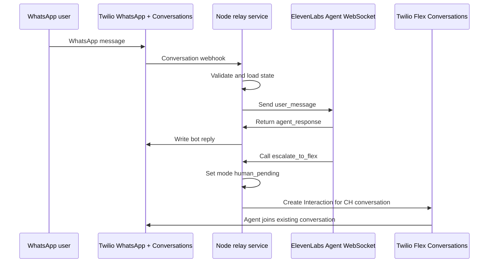

# WhatsApp ElevenLabs Flex Relay Design

Date: 2026-08-12

## Summary

Build a blueprint for a two-way WhatsApp relay where Twilio owns the WhatsApp sender and Twilio Conversation from the start, a small Node.js service relays bot-mode messages to ElevenLabs, and Twilio Flex receives the existing conversation when ElevenLabs escalates to a human.

This is a messaging analogue to the Twilio ElevenLabs call handoff blueprint. The shared pattern is Twilio-owned routing plus an ElevenLabs webhook tool for handoff context. The key difference is that WhatsApp handoff routes an existing asynchronous Twilio Conversation to Flex, rather than updating a live Twilio Call resource.

## Goals

- Document the recommended Twilio Conversations-first architecture.
- Support local development with ngrok.
- Keep Twilio as the source of truth for the WhatsApp sender, customer thread, and Flex routing.
- Use ElevenLabs Agent WebSocket as the AI runtime for text turns.
- Escalate to Flex by creating an Interaction bound to the existing Twilio Conversation.
- Prevent bot and human agents from responding at the same time.
- Include enough example configuration for a builder to implement the relay.

## Non-Goals

- Implement the Node relay service in this design step.
- Import or transfer WhatsApp ownership to ElevenLabs.
- Build Flex UI plugin customizations.
- Fully design production data retention, compliance, or CRM integrations.
- Support every WhatsApp media type in the first implementation.

## Architecture

The relay service exposes Twilio and ElevenLabs webhook endpoints and owns the message orchestration loop.



## Components

### Twilio Conversations Adapter

Responsibilities:

- Validate Twilio request signatures.
- Normalize WhatsApp addresses.
- Resolve or create the active Twilio Conversation.
- Write bot replies into the existing Conversation.
- Track message delivery status and failures.

### ElevenLabs Session Manager

Responsibilities:

- Open an Agent WebSocket session for bot-mode conversations.
- Send `conversation_initiation_client_data` with Twilio context.
- Relay customer messages as `user_message`.
- Collect `agent_response` events.
- Handle ping/pong and tool events.
- Recover or recreate session state after reconnects.

### Conversation State Store

Responsibilities:

- Persist `conversationSid`, customer address, business address, mode, ElevenLabs conversation ID, handoff ID, Flex Interaction SID, Task SID, and timestamps.
- Enforce atomic transitions from `bot` to `human_pending`.
- Record idempotency keys for Twilio events, bot replies, and handoffs.

### Handoff Controller

Responsibilities:

- Receive `POST /webhooks/elevenlabs/escalate-to-flex`.
- Validate bearer token and payload.
- Switch the conversation to `human_pending`.
- Create the Flex Interaction using the existing `CH...` Conversation SID.
- Store returned Flex IDs.
- Return existing handoff details for duplicate requests.

### Agent Control

Responsibilities:

- Stop relaying new customer messages to ElevenLabs after escalation starts.
- Optionally support an admin reset back to bot mode after a human closes the thread.

### Observability

Responsibilities:

- Log correlation IDs across Twilio Message SID, Conversation SID, ElevenLabs conversation ID, Flex Interaction SID, Task SID, and handoff ID.
- Emit metrics for bot latency, escalation creation failures, duplicate events, and webhook failures.

## State Machine

| Mode | Meaning | Customer message handling |
| --- | --- | --- |
| `bot` | ElevenLabs handles the thread. | Relay to ElevenLabs and write bot reply to Twilio. |
| `human_pending` | Flex escalation is in progress. | Do not relay to ElevenLabs. |
| `human` | Flex agent owns the thread. | Do not relay to ElevenLabs. |
| `closed` | Thread is complete. | Ignore, archive, or start a new policy-defined session. |

The `bot -> human_pending` transition must be persisted before creating the Flex Interaction. This avoids a race where the customer sends another message while Flex routing is being created.

## Data Contracts

### ElevenLabs Dynamic Variables

```json
{
  "twilioConversationSid": "CHxxxxxxxxxxxxxxxxxxxxxxxxxxxxxxxx",
  "customerAddress": "whatsapp:+15551234567",
  "businessAddress": "whatsapp:+14155238886",
  "handoffId": "handoff_CHxxxxxxxx_1700000000000"
}
```

### ElevenLabs Escalation Request

```json
{
  "conversationSid": "CHxxxxxxxxxxxxxxxxxxxxxxxxxxxxxxxx",
  "elevenlabsConversationId": "conv_abc123",
  "handoffId": "handoff_CHxxxxxxxx_1700000000000",
  "customerAddress": "whatsapp:+15551234567",
  "businessAddress": "whatsapp:+14155238886",
  "intent": "billing_dispute",
  "reason": "explicit_human_request",
  "summary": "Customer is disputing a recent charge and wants a human agent to review the account.",
  "priority": 5
}
```

### Flex Interaction Attributes

```json
{
  "channelType": "whatsapp",
  "direction": "inbound",
  "from": "whatsapp:+15551234567",
  "customerAddress": "whatsapp:+15551234567",
  "customerName": "whatsapp:+15551234567",
  "conversationSid": "CHxxxxxxxxxxxxxxxxxxxxxxxxxxxxxxxx",
  "elevenlabsConversationId": "conv_abc123",
  "handoffId": "handoff_CHxxxxxxxx_1700000000000",
  "reason": "explicit_human_request",
  "intent": "billing_dispute",
  "summary": "Customer is disputing a recent charge and wants a human agent to review the account."
}
```

## Local Development

The recommended local loop uses ngrok:

```bash
npm run dev
ngrok http 3000
```

Configure Twilio Conversations and ElevenLabs tool URLs to the ngrok HTTPS domain:

```text
https://<ngrok-host>/webhooks/twilio/conversation
https://<ngrok-host>/webhooks/twilio/message-status
https://<ngrok-host>/webhooks/elevenlabs/escalate-to-flex
```

The relay should expose `GET /health` to validate configuration before updating Twilio webhooks.

## Error Handling

- Invalid Twilio signature: return `403`.
- Duplicate Twilio message event: return success without reprocessing.
- ElevenLabs unavailable: send a short fallback WhatsApp message and optionally offer human escalation.
- ElevenLabs timeout: retry once if safe, otherwise fallback/escalate according to product policy.
- Invalid escalation payload: return `400` and leave state unchanged.
- Duplicate escalation: return the stored Flex Interaction SID.
- Flex Interaction creation failure: keep state `human_pending`, log loudly, and retry or alert.

## Testing Strategy

Unit tests:

- Twilio signature validation and raw-body handling.
- Conversation state transitions.
- Idempotency checks.
- ElevenLabs event parsing.
- Bot reply write payloads.
- Escalation payload validation.
- Flex Interaction request construction.

Integration tests:

- Local ngrok inbound WhatsApp message to bot reply.
- Escalation tool call to Flex Interaction creation.
- Duplicate webhook and duplicate escalation handling.
- Post-escalation customer messages do not reach ElevenLabs.

Manual Flex checks:

- Agent receives the WhatsApp task.
- Existing Twilio Conversation transcript is visible.
- Task attributes include summary, intent, reason, `conversationSid`, and `handoffId`.

## Alternatives Considered

### Twilio Functions Only

Twilio Functions can receive webhooks and make API calls, but their short execution lifecycle is a poor fit for long-lived ElevenLabs WebSocket sessions and async bot/handoff orchestration. A Functions-only proof of concept can open a fresh WebSocket per customer message and exit after one answer, but this design treats that as a constrained demo path only.

### Studio-Orchestrated Flow

Studio can orchestrate messaging flows and Send to Flex, but the bot relay needs more control over session state, WebSocket handling, idempotency, and post-handoff bot suppression. Studio remains useful for teams that prefer no-code routing before handoff, but it is not the recommended core relay.

### ElevenLabs Owns WhatsApp

ElevenLabs can connect to a WhatsApp Business account directly, but that conflicts with the requirement that Twilio owns the sender and thread from the start. It would also make Flex handoff more about copying context than routing the original Twilio Conversation.

## Approval

The user approved:

- Twilio owns the WhatsApp number/thread from the start.
- Use the Twilio Conversations-first relay.
- Use a small Node.js service as the recommended implementation.
- Use ngrok for local testing.

## Next Step

After this blueprint is reviewed, create an implementation plan for the Node relay service.
